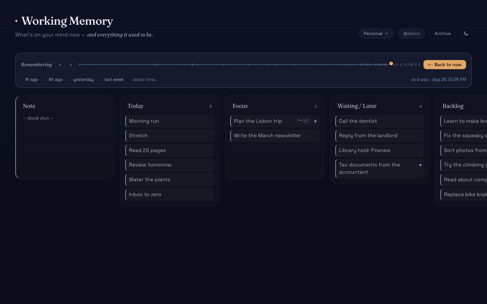
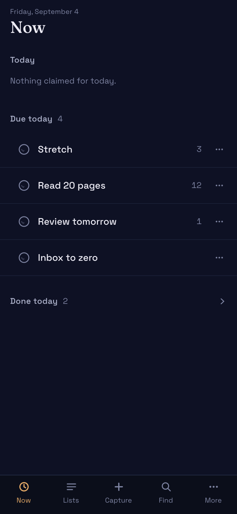
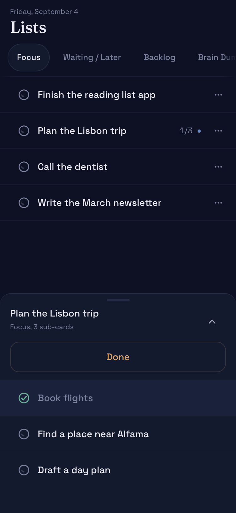

# Working Memory

A board for what's on your mind — Today, Focus, Waiting, Backlog, Brain Dump — where
every change is kept, so you can scrub back through the board's history and see it as
it actually was. Live demo: **[workingmemory.onrender.com](https://workingmemory.onrender.com)**
(no signup, a throwaway board seeded with a few weeks of history; the free tier takes
about a minute to wake up).

[](https://github.com/carlitoswillis/workingmemory/actions/workflows/ci.yml)



*The scrubber pulled back to a past moment — the board re-renders as it was, read-only.*

<p align="center">
  
  
</p>

*The phone app: a Now feed you can tick through, and a card sheet for everything else.*

## What it does

- Five lists — Today, Focus, Waiting / Later, Backlog, Brain Dump — plus a pinned daily
  note. Columns can be renamed, added, reordered or removed.
- Recurring cards that reset each day or on a chosen weekday, with a streak count.
- Sub-cards at any depth, each with its own history; cards can also open into a whole board.
- Time travel over an append-only event log: drag the scrubber and the board re-renders at
  that moment. The ticks are the real moments something changed.
- A weekly review written from that history — what you finished, what moved, what has been
  parked in Waiting. It is generated by a script on your own machine; the server holds no
  API key.
- A phone app with one-tap completion, bottom sheets for card details, capture, search and
  time travel, and Web Push once it is installed to the Home Screen.
- Light and dark, following the system theme until you pick one.
- Shared boards: invite another account by username; each side sees the other's changes
  within about a second.

## How it's built

- **Next.js 14 (App Router), React 18, TypeScript** — server components and server actions,
  no separate API layer for the app itself.
- **SQLite via better-sqlite3.** Triggers on `items` append to `item_events`, so every
  change is journaled at the database layer rather than by app code, and time travel is a
  replay of that log. See [`ai/ARCHITECTURE.md`](ai/ARCHITECTURE.md).
- **Litestream to Backblaze B2** — continuous replication with restore-on-boot, so the host
  needs no persistent disk and every deploy doubles as a restore drill.
- **Render's free tier**, built from the `Dockerfile` per `render.yaml`; sessions are
  stateless HMAC cookies, so there is no session store to keep.
- **The phone app is its own shell** under `components/phone` — same data and same server
  actions as the desktop board, no shared layout. Tests are plain node suites run by
  `npm test`.

## Run it

```bash
npm install
npm run dev        # http://localhost:3000, data in ./data/wm.db
npm run dev:demo   # the hosted demo experience: a throwaway board per visitor
npm run build
npm test
```

Local use needs no configuration. Everything else is optional and documented in
`.env.local.example`: `DATA_DIR`, `DEMO_MODE`, `OWNER_SECRET`, `BRAIN_TOKEN`,
`WM_OWNER_BOARD_ID`, `OWNER_USERNAME`, `VAPID_PUBLIC_KEY`, `VAPID_PRIVATE_KEY`,
`VAPID_SUBJECT`.

Three endpoints exist for a companion app on my own machine, all behind the same
`BRAIN_TOKEN` bearer (unset it and they 404). `GET /api/context` returns the open cards on
the owner's board as compact triage context. `POST /api/items` creates one card through the
normal write path, so the triggers journal it like any other write. `POST /api/push/send`
delivers a Web Push notification to the owner's subscribed devices.

## Design

The phone app's design is written down in two plans:
[`ai/plans/2026-09-04-phone-app.md`](ai/plans/2026-09-04-phone-app.md) (screen map, the
completion moment, touch rules, the iOS install checklist) and
[`ai/plans/2026-09-04-phone-app-second-pass.md`](ai/plans/2026-09-04-phone-app-second-pass.md)
(the tightening pass, with the type ladder and the decisions behind it).

The palette is called Nocturne: a near-black ground, one amber accent for *now* and a blue
for the past, elevation as a luminance step and a hairline rather than a shadow.

The phone idea is one row at every depth — a sub-card is the same row as a top-level card,
same height, same check target, no indent and no smaller type.

Current state, backlog and the ops notes worth knowing live in
[`ai/PROJECT_STATE.md`](ai/PROJECT_STATE.md).

